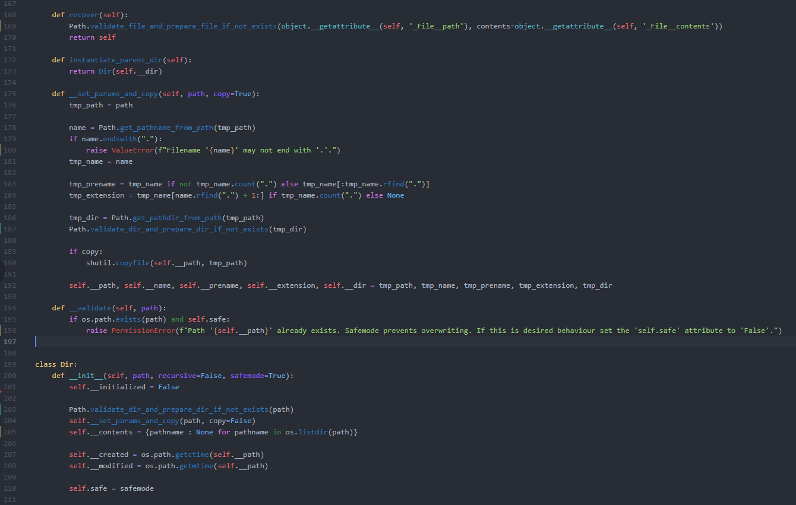

## Mett's Dark Snek Syntax theme

A syntax highlighting theme for MagicPython based off 'One Dark' with lots of tweaks to the existing colors and several Python-specific syntax highlighting features not used in the original.

Intended for use with a dark ui theme.

Non-python languages will still retain the base syntax highlighting from the 'One Dark' syntax theme.

### Install

This theme is installed by default with Atom and can be activated by going to the __Settings > Themes__ section and selecting it from the __Syntax Themes__ drop-down menu.
