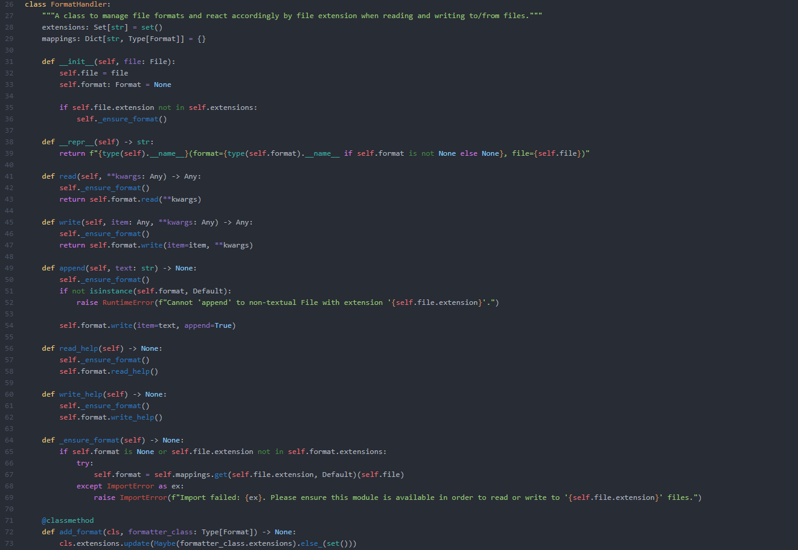

## Mett's Dark Snek Syntax theme

A syntax highlighting theme for MagicPython based off 'One Dark' with lots of tweaks to the existing colors and several Python-specific syntax highlighting features not used in the original.

Intended for use with a dark ui theme.

Non-python languages will still retain the base syntax highlighting from the 'One Dark' syntax theme.

### Install

Until I can figure out why I keep getting errors when trying to publish it to the atom repository, this theme must be cloned from GitHub and manually installed. There are tutorials on how to do this elsewhere. It can then be activated by going to the __Settings > Themes__ section and selecting it from the __Syntax Themes__ drop-down menu.
